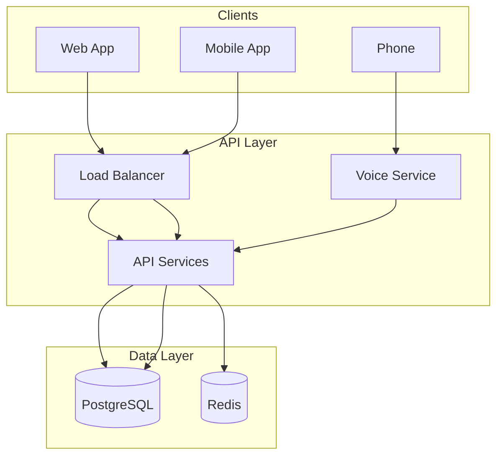

# MechMind OS Documentation

Welcome to the MechMind OS documentation. MechMind OS is a multi-tenant SaaS platform for automotive repair shops with AI-powered voice booking capabilities.

## Documentation Index

### 📚 API Documentation

| Document | Description |
|----------|-------------|
| [OpenAPI Specification](api/openapi.yaml) | Complete API specification (OpenAPI 3.0) |
| [Authentication](api/endpoints/authentication.md) | JWT authentication and authorization |
| [Bookings API](api/endpoints/bookings.md) | Booking management endpoints |
| [Voice Webhooks](api/endpoints/voice-webhooks.md) | Vapi voice integration webhooks |

### 📋 Operational Runbooks

| Document | Description |
|----------|-------------|
| [Incident Response](runbooks/incident-response.md) | P0/P1 incident handling procedures |
| [Database Operations](runbooks/database-operations.md) | Backup, restore, and maintenance |
| [Deployment](runbooks/deployment.md) | Deployment procedures and strategies |
| [Monitoring](runbooks/monitoring.md) | Alert response and metric interpretation |
| [GDPR Requests](runbooks/gdpr-requests.md) | Data subject request handling |

### 🏗️ Architecture Documentation

| Document | Description |
|----------|-------------|
| [Overview](architecture/overview.md) | High-level system architecture |
| [Database](architecture/database.md) | Database design, RLS, and partitioning |
| [Voice Flow](architecture/voice-flow.md) | Voice AI integration architecture |
| [Security](architecture/security.md) | Security model and implementation |
| [Compliance](architecture/compliance.md) | GDPR, CCPA, SOC 2 compliance |

### 💻 Developer Guide

| Document | Description |
|----------|-------------|
| [Setup](developers/setup.md) | Local development environment setup |
| [Testing](developers/testing.md) | Testing strategies and practices |
| [Contributing](developers/contributing.md) | Contribution guidelines |

## Quick Links

### Getting Started

```bash
# Clone repository
git clone https://github.com/mechmind/mechmind-os.git
cd mechmind-os

# Setup environment
cp .env.example .env
make setup

# Start development server
make dev
```

### API Base URLs

| Environment | URL |
|-------------|-----|
| Production | `https://api.mechmind.io/v1` |
| Staging | `https://api-staging.mechmind.io/v1` |
| Sandbox | `https://api-sandbox.mechmind.io/v1` |

### Authentication

```bash
# Get access token
curl -X POST https://api.mechmind.io/v1/auth/login \
  -H "Content-Type: application/json" \
  -d '{
    "email": "your@email.com",
    "password": "your-password"
  }'

# Use token in requests
curl https://api.mechmind.io/v1/bookings \
  -H "Authorization: Bearer YOUR_ACCESS_TOKEN"
```

## System Overview



## Key Features

- **Multi-tenant Architecture**: Row-level security for data isolation
- **AI Voice Booking**: Natural language appointment scheduling via phone
- **Real-time Availability**: Advisory locks prevent double-booking
- **GDPR Compliant**: Data export, deletion, and consent management
- **Scalable**: Auto-scaling Kubernetes deployment

## Architecture Highlights

### Multi-Tenant Design

- Single database with schema-per-tenant
- Row-Level Security (RLS) for data isolation
- Tenant context set per request

### Voice Integration

- Vapi AI for natural language processing
- Webhook-based booking flow
- Advisory locks for concurrency control

### Security

- JWT-based authentication
- Role-based access control (RBAC)
- Encryption at rest and in transit
- Audit logging

## Support

- **Documentation**: https://docs.mechmind.io
- **API Status**: https://status.mechmind.io
- **Support Email**: support@mechmind.io
- **Slack**: #mechmind-support

## Contributing

We welcome contributions! Please see our [Contributing Guidelines](developers/contributing.md) for details.

## License

Proprietary - Copyright © 2024 MechMind Inc.

---

*Last updated: January 2024*
