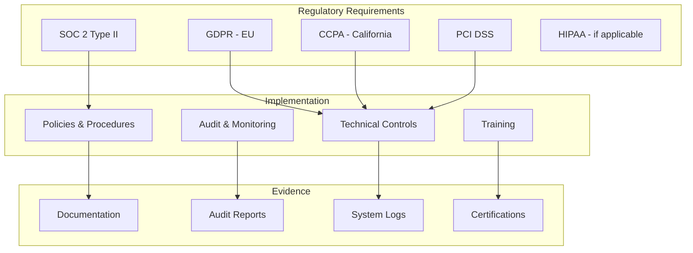

# Compliance Documentation

MechMind OS is designed to meet regulatory requirements for data protection, privacy, and security across multiple jurisdictions.

## Compliance Framework



## GDPR Compliance

### Data Subject Rights

| Right | Implementation | Status |
|-------|----------------|--------|
| Right to Access | `/v1/customers/{id}/export` endpoint | ✅ |
| Right to Rectification | Customer update API | ✅ |
| Right to Erasure | Soft delete + 30-day purge | ✅ |
| Right to Restrict Processing | Account suspension | ✅ |
| Right to Data Portability | JSON/CSV export | ✅ |
| Right to Object | Opt-out mechanisms | ✅ |

### Data Processing Records

```sql
-- Data processing activities log
CREATE TABLE data_processing_log (
    id UUID PRIMARY KEY DEFAULT gen_random_uuid(),
    tenant_id UUID NOT NULL,
    processing_activity VARCHAR(100) NOT NULL,
    data_subject_type VARCHAR(50) NOT NULL,
    legal_basis VARCHAR(50) NOT NULL,
    data_categories TEXT[],
    recipients TEXT[],
    retention_period_days INTEGER,
    security_measures TEXT[],
    created_at TIMESTAMP DEFAULT NOW()
);

-- Record processing activity
INSERT INTO data_processing_log (
    tenant_id,
    processing_activity,
    data_subject_type,
    legal_basis,
    data_categories,
    recipients,
    retention_period_days,
    security_measures
) VALUES (
    'tenant_123',
    'booking_management',
    'customer',
    'contract',
    ARRAY['contact_info', 'vehicle_info', 'service_history'],
    ARRAY['shop_staff', 'payment_processor'],
    2555, -- 7 years
    ARRAY['encryption', 'access_controls', 'audit_logging']
);
```

### Consent Management

```python
# compliance/consent_manager.py
from enum import Enum
from datetime import datetime

class ConsentType(Enum):
    MARKETING = "marketing"
    ANALYTICS = "analytics"
    THIRD_PARTY = "third_party_sharing"
    SMS = "sms_notifications"
    EMAIL = "email_notifications"

class ConsentManager:
    def __init__(self, db):
        self.db = db
    
    async def record_consent(
        self,
        customer_id: str,
        consent_type: ConsentType,
        granted: bool,
        ip_address: str = None,
        user_agent: str = None
    ):
        """Record consent change with audit trail"""
        
        await self.db.execute(
            """
            INSERT INTO consent_records 
            (customer_id, consent_type, granted, ip_address, user_agent, timestamp)
            VALUES ($1, $2, $3, $4, $5, $6)
            """,
            customer_id,
            consent_type.value,
            granted,
            ip_address,
            user_agent,
            datetime.utcnow()
        )
    
    async def check_consent(self, customer_id: str, consent_type: ConsentType) -> bool:
        """Check current consent status"""
        
        result = await self.db.fetchrow(
            """
            SELECT granted 
            FROM consent_records 
            WHERE customer_id = $1 AND consent_type = $2
            ORDER BY timestamp DESC
            LIMIT 1
            """,
            customer_id,
            consent_type.value
        )
        
        return result["granted"] if result else False
    
    async def withdraw_all_consent(self, customer_id: str):
        """Withdraw all consents for a customer"""
        
        for consent_type in ConsentType:
            await self.record_consent(
                customer_id=customer_id,
                consent_type=consent_type,
                granted=False
            )
```

### Data Retention Policy

```python
# compliance/retention_policy.py
from datetime import datetime, timedelta

RETENTION_PERIODS = {
    "customer_data": {
        "active_customer": timedelta(days=2555),  # 7 years
        "inactive_customer": timedelta(days=365),  # 1 year
    },
    "booking_records": {
        "completed": timedelta(days=2555),  # 7 years (tax requirement)
        "cancelled": timedelta(days=365),
    },
    "call_recordings": {
        "default": timedelta(days=90),
        "dispute": timedelta(days=2555),
    },
    "audit_logs": {
        "default": timedelta(days=2555),  # 7 years
    },
    "session_logs": {
        "default": timedelta(days=30),
    }
}

class RetentionEnforcer:
    def __init__(self, db):
        self.db = db
    
    async def enforce_retention_policies(self):
        """Apply retention policies and purge expired data"""
        
        # Anonymize inactive customers
        await self.db.execute(
            """
            UPDATE customers
            SET 
                first_name = NULL,
                last_name = NULL,
                phone = NULL,
                email = NULL,
                notes = NULL,
                anonymized_at = NOW()
            WHERE 
                deleted_at IS NOT NULL
                AND deleted_at < NOW() - INTERVAL '1 year'
                AND anonymized_at IS NULL
            """
        )
        
        # Purge old call recordings
        await self.db.execute(
            """
            DELETE FROM call_recordings
            WHERE created_at < NOW() - INTERVAL '90 days'
              AND dispute_flag = false
            """
        )
        
        # Purge old session logs
        await self.db.execute(
            """
            DELETE FROM session_logs
            WHERE created_at < NOW() - INTERVAL '30 days'
            """
        )
```

## CCPA Compliance

### Consumer Rights

| Right | Implementation |
|-------|----------------|
| Know | Privacy policy, data inventory |
| Delete | GDPR deletion process |
| Opt-out | "Do Not Sell" mechanism |
| Non-discrimination | No service degradation for opt-outs |

### Privacy Policy Requirements

```
MechMind Privacy Policy - Required Disclosures:

1. Categories of personal information collected
2. Sources of personal information
3. Business/commercial purposes for collection
4. Categories of third parties information is shared with
5. Consumer rights under CCPA
6. Methods for submitting consumer requests
7. "Do Not Sell My Personal Information" link
```

### Do Not Sell Mechanism

```python
# compliance/ccpa_manager.py

class CCPAManager:
    def __init__(self, db):
        self.db = db
    
    async def opt_out_of_sale(self, consumer_email: str, ip_address: str = None):
        """Record consumer opt-out of data sale"""
        
        # Find customer by email
        customer = await self.db.fetchrow(
            "SELECT id FROM customers WHERE email = $1",
            consumer_email
        )
        
        if customer:
            await self.db.execute(
                """
                INSERT INTO ccpa_opt_outs 
                (customer_id, email, opt_out_type, ip_address, timestamp)
                VALUES ($1, $2, 'do_not_sell', $3, $4)
                ON CONFLICT (customer_id, opt_out_type) DO UPDATE
                SET timestamp = $4
                """,
                customer["id"],
                consumer_email,
                ip_address,
                datetime.utcnow()
            )
            
            # Update customer record
            await self.db.execute(
                "UPDATE customers SET data_sale_opt_out = true WHERE id = $1",
                customer["id"]
            )
    
    async def check_opt_out_status(self, customer_id: str) -> dict:
        """Check customer's CCPA opt-out status"""
        
        result = await self.db.fetchrow(
            """
            SELECT 
                data_sale_opt_out,
                (SELECT timestamp FROM ccpa_opt_outs 
                 WHERE customer_id = $1 AND opt_out_type = 'do_not_sell') as opt_out_date
            FROM customers
            WHERE id = $1
            """,
            customer_id
        )
        
        return {
            "do_not_sell": result["data_sale_opt_out"] if result else False,
            "opt_out_date": result["opt_out_date"] if result else None
        }
```

## SOC 2 Type II

### Trust Service Criteria

| Criteria | Controls | Evidence |
|----------|----------|----------|
| Security | Access controls, encryption, monitoring | Audit logs, pen test reports |
| Availability | Uptime monitoring, DR plan | Status page, DR test results |
| Processing Integrity | Input validation, error handling | Test results, incident logs |
| Confidentiality | Data classification, encryption | Data flow diagrams, key management |
| Privacy | Consent management, data minimization | Privacy policy, consent records |

### Access Control Matrix

```yaml
# access_control_matrix.yaml
roles:
  super_admin:
    description: "Platform administrators"
    systems:
      - production_db: full
      - production_api: full
      - aws_console: full
    mfa_required: true
    
  shop_admin:
    description: "Shop owners/managers"
    systems:
      - production_db: tenant_scoped
      - production_api: tenant_scoped
    mfa_required: true
    
  mechanic:
    description: "Shop mechanics"
    systems:
      - production_api: read_own_bookings
    mfa_required: false
    
  developer:
    description: "Engineering team"
    systems:
      - staging: full
      - production_db: read_only
      - production_logs: read_only
    mfa_required: true
```

### Change Management

```python
# compliance/change_management.py
from enum import Enum

class ChangeType(Enum):
    STANDARD = "standard"
    EMERGENCY = "emergency"
    NORMAL = "normal"

class ChangeManager:
    def __init__(self, db):
        self.db = db
    
    async def submit_change_request(
        self,
        title: str,
        description: str,
        change_type: ChangeType,
        systems_affected: list[str],
        risk_level: str,
        rollback_plan: str,
        requested_by: str
    ) -> str:
        """Submit change request for approval"""
        
        change_id = f"CHG-{datetime.utcnow().strftime('%Y%m%d')}-{uuid.uuid4().hex[:8]}"
        
        await self.db.execute(
            """
            INSERT INTO change_requests
            (change_id, title, description, change_type, systems_affected,
             risk_level, rollback_plan, requested_by, status, created_at)
            VALUES ($1, $2, $3, $4, $5, $6, $7, $8, 'pending', $9)
            """,
            change_id, title, description, change_type.value,
            systems_affected, risk_level, rollback_plan, requested_by,
            datetime.utcnow()
        )
        
        # Notify approvers
        await notify_approvers(change_id, risk_level)
        
        return change_id
    
    async def approve_change(self, change_id: str, approved_by: str):
        """Approve change request"""
        
        await self.db.execute(
            """
            UPDATE change_requests
            SET status = 'approved',
                approved_by = $2,
                approved_at = $3
            WHERE change_id = $1
            """,
            change_id, approved_by, datetime.utcnow()
        )
    
    async def implement_change(self, change_id: str, implemented_by: str):
        """Record change implementation"""
        
        await self.db.execute(
            """
            UPDATE change_requests
            SET status = 'implemented',
                implemented_by = $2,
                implemented_at = $3
            WHERE change_id = $1
            """,
            change_id, implemented_by, datetime.utcnow()
        )
```

## PCI DSS

### Cardholder Data Environment (CDE)

MechMind OS does **not** store cardholder data. All payment processing is handled by Stripe.

```
PCI DSS Scope:
- Out of scope: Card numbers, CVV, track data
- In scope: Payment references, transaction IDs
- Third-party: Stripe (PCI DSS Level 1 certified)
```

### Payment Security

```python
# payments/secure_payment.py
import stripe

class SecurePaymentHandler:
    def __init__(self):
        stripe.api_key = STRIPE_SECRET_KEY
    
    async def create_payment_intent(
        self,
        amount: int,
        currency: str,
        customer_id: str,
        metadata: dict
    ) -> dict:
        """Create payment intent (never touches card data)"""
        
        intent = stripe.PaymentIntent.create(
            amount=amount,
            currency=currency,
            customer=customer_id,
            metadata={
                "tenant_id": metadata.get("tenant_id"),
                "booking_id": metadata.get("booking_id"),
                # Never include card data!
            },
            automatic_payment_methods={"enabled": True}
        )
        
        # Store only the payment intent ID
        await self.db.execute(
            """
            INSERT INTO payment_records
            (payment_intent_id, amount, currency, status, tenant_id, booking_id)
            VALUES ($1, $2, $3, $4, $5, $6)
            """,
            intent.id,
            amount,
            currency,
            intent.status,
            metadata.get("tenant_id"),
            metadata.get("booking_id")
        )
        
        return {"client_secret": intent.client_secret}
```

## Audit & Reporting

### Compliance Dashboard

```sql
-- GDPR metrics view
CREATE VIEW v_gdpr_metrics AS
SELECT
    tenant_id,
    COUNT(*) FILTER (WHERE deleted_at IS NOT NULL) as pending_deletion_requests,
    COUNT(*) FILTER (WHERE anonymized_at IS NOT NULL) as anonymized_records,
    MAX(deleted_at) as oldest_deletion_request
FROM customers
GROUP BY tenant_id;

-- Consent metrics
CREATE VIEW v_consent_metrics AS
SELECT
    consent_type,
    COUNT(*) FILTER (WHERE granted = true) as granted_count,
    COUNT(*) FILTER (WHERE granted = false) as denied_count,
    COUNT(DISTINCT customer_id) as total_customers
FROM consent_records
WHERE timestamp > NOW() - INTERVAL '30 days'
GROUP BY consent_type;
```

### Compliance Report Generation

```python
# compliance/reporting.py
import pandas as pd
from datetime import datetime, timedelta

class ComplianceReporter:
    def __init__(self, db):
        self.db = db
    
    async def generate_gdpr_report(self, start_date: datetime, end_date: datetime) -> dict:
        """Generate GDPR compliance report"""
        
        # Data subject requests
        requests = await self.db.fetch(
            """
            SELECT 
                request_type,
                status,
                COUNT(*) as count,
                AVG(EXTRACT(EPOCH FROM (completed_at - received_at))/86400) as avg_days
            FROM gdpr_requests
            WHERE received_at BETWEEN $1 AND $2
            GROUP BY request_type, status
            """,
            start_date, end_date
        )
        
        # Consent statistics
        consent_stats = await self.db.fetch(
            """
            SELECT 
                consent_type,
                granted,
                COUNT(*) as count
            FROM consent_records
            WHERE timestamp BETWEEN $1 AND $2
            GROUP BY consent_type, granted
            """,
            start_date, end_date
        )
        
        return {
            "period": f"{start_date.date()} to {end_date.date()}",
            "data_subject_requests": [dict(r) for r in requests],
            "consent_statistics": [dict(r) for r in consent_stats],
            "generated_at": datetime.utcnow()
        }
    
    async def generate_audit_trail(self, resource_type: str, resource_id: str) -> list:
        """Generate complete audit trail for a resource"""
        
        records = await self.db.fetch(
            """
            SELECT *
            FROM audit_log
            WHERE resource_type = $1 AND resource_id = $2
            ORDER BY timestamp DESC
            """,
            resource_type, resource_id
        )
        
        return [dict(r) for r in records]
```

## Training & Awareness

### Required Training

| Role | Training | Frequency |
|------|----------|-----------|
| All employees | Security awareness | Annual |
| Developers | Secure coding | Annual |
| Operations | Incident response | Semi-annual |
| Management | Privacy regulations | Annual |

### Training Topics

- Data protection principles (GDPR/CCPA)
- Phishing awareness
- Secure password practices
- Incident reporting procedures
- Data handling procedures

## Compliance Checklist

### Pre-Launch

- [ ] Privacy policy published
- [ ] Terms of service updated
- [ ] Cookie consent implemented
- [ ] Data processing agreements signed
- [ ] Security assessment completed
- [ ] Penetration test passed

### Ongoing

- [ ] Quarterly access reviews
- [ ] Annual risk assessment
- [ ] Regular vulnerability scans
- [ ] Incident response drills
- [ ] Compliance training completed
- [ ] Audit logs reviewed
