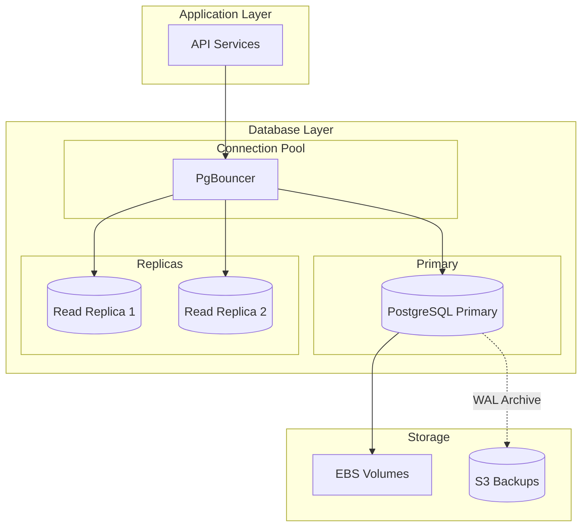

# Database Architecture

MechMind OS uses PostgreSQL 15 as the primary database, designed for multi-tenant SaaS with strong data isolation and performance.

## Architecture Overview



## Schema Design

### Core Tables

```sql
-- Tenants (Shops)
CREATE TABLE tenants (
    id UUID PRIMARY KEY DEFAULT gen_random_uuid(),
    name VARCHAR(255) NOT NULL,
    subdomain VARCHAR(100) UNIQUE NOT NULL,
    subscription_tier VARCHAR(50) DEFAULT 'basic',
    settings JSONB DEFAULT '{}',
    created_at TIMESTAMP DEFAULT NOW(),
    updated_at TIMESTAMP DEFAULT NOW(),
    deleted_at TIMESTAMP
);

-- Users (Shop staff)
CREATE TABLE users (
    id UUID PRIMARY KEY DEFAULT gen_random_uuid(),
    tenant_id UUID NOT NULL REFERENCES tenants(id),
    email VARCHAR(255) NOT NULL,
    password_hash VARCHAR(255) NOT NULL,
    first_name VARCHAR(100),
    last_name VARCHAR(100),
    role VARCHAR(50) DEFAULT 'mechanic',
    is_active BOOLEAN DEFAULT true,
    last_login_at TIMESTAMP,
    created_at TIMESTAMP DEFAULT NOW(),
    updated_at TIMESTAMP DEFAULT NOW(),
    UNIQUE(tenant_id, email)
);

-- Customers
CREATE TABLE customers (
    id UUID PRIMARY KEY DEFAULT gen_random_uuid(),
    tenant_id UUID NOT NULL REFERENCES tenants(id),
    first_name VARCHAR(100),
    last_name VARCHAR(100),
    phone VARCHAR(20),
    email VARCHAR(255),
    notes TEXT,
    created_at TIMESTAMP DEFAULT NOW(),
    updated_at TIMESTAMP DEFAULT NOW(),
    deleted_at TIMESTAMP
);

-- Mechanics
CREATE TABLE mechanics (
    id UUID PRIMARY KEY DEFAULT gen_random_uuid(),
    tenant_id UUID NOT NULL REFERENCES tenants(id),
    user_id UUID REFERENCES users(id),
    first_name VARCHAR(100) NOT NULL,
    last_name VARCHAR(100) NOT NULL,
    email VARCHAR(255),
    phone VARCHAR(20),
    specialties TEXT[],
    is_active BOOLEAN DEFAULT true,
    created_at TIMESTAMP DEFAULT NOW(),
    updated_at TIMESTAMP DEFAULT NOW()
);

-- Time Slots
CREATE TABLE time_slots (
    id UUID PRIMARY KEY DEFAULT gen_random_uuid(),
    tenant_id UUID NOT NULL REFERENCES tenants(id),
    mechanic_id UUID NOT NULL REFERENCES mechanics(id),
    start_time TIMESTAMP NOT NULL,
    end_time TIMESTAMP NOT NULL,
    is_available BOOLEAN DEFAULT true,
    is_reserved BOOLEAN DEFAULT false,
    reserved_until TIMESTAMP,
    booking_id UUID,
    created_at TIMESTAMP DEFAULT NOW(),
    updated_at TIMESTAMP DEFAULT NOW()
);

-- Bookings
CREATE TABLE bookings (
    id UUID PRIMARY KEY DEFAULT gen_random_uuid(),
    tenant_id UUID NOT NULL REFERENCES tenants(id),
    slot_id UUID NOT NULL REFERENCES time_slots(id),
    mechanic_id UUID NOT NULL REFERENCES mechanics(id),
    customer_id UUID NOT NULL REFERENCES customers(id),
    status VARCHAR(50) DEFAULT 'pending',
    service_type VARCHAR(100),
    vehicle_info JSONB,
    notes TEXT,
    source VARCHAR(50) DEFAULT 'web',
    created_at TIMESTAMP DEFAULT NOW(),
    updated_at TIMESTAMP DEFAULT NOW(),
    confirmed_at TIMESTAMP,
    completed_at TIMESTAMP,
    cancelled_at TIMESTAMP
);

-- Indexes
CREATE INDEX idx_customers_tenant_phone ON customers(tenant_id, phone);
CREATE INDEX idx_customers_tenant_email ON customers(tenant_id, email);
CREATE INDEX idx_bookings_tenant_status ON bookings(tenant_id, status);
CREATE INDEX idx_bookings_tenant_date ON bookings(tenant_id, created_at);
CREATE INDEX idx_time_slots_tenant_mechanic ON time_slots(tenant_id, mechanic_id);
CREATE INDEX idx_time_slots_start_time ON time_slots(start_time);
```

## Row-Level Security (RLS)

### Tenant Isolation

```sql
-- Enable RLS on all tenant-scoped tables
ALTER TABLE customers ENABLE ROW LEVEL SECURITY;
ALTER TABLE mechanics ENABLE ROW LEVEL SECURITY;
ALTER TABLE time_slots ENABLE ROW LEVEL SECURITY;
ALTER TABLE bookings ENABLE ROW LEVEL SECURITY;

-- Create tenant isolation policy
CREATE POLICY tenant_isolation_customers ON customers
    USING (tenant_id = current_setting('app.current_tenant')::UUID);

CREATE POLICY tenant_isolation_mechanics ON mechanics
    USING (tenant_id = current_setting('app.current_tenant')::UUID);

CREATE POLICY tenant_isolation_time_slots ON time_slots
    USING (tenant_id = current_setting('app.current_tenant')::UUID);

CREATE POLICY tenant_isolation_bookings ON bookings
    USING (tenant_id = current_setting('app.current_tenant')::UUID);

-- Set tenant context in application
SET app.current_tenant = '550e8400-e29b-41d4-a716-446655440000';
```

### Role-Based Access

```sql
-- Create application roles
CREATE ROLE app_readonly;
CREATE ROLE app_readwrite;
CREATE ROLE app_admin;

-- Grant permissions
GRANT SELECT ON ALL TABLES IN SCHEMA public TO app_readonly;
GRANT SELECT, INSERT, UPDATE ON ALL TABLES IN SCHEMA public TO app_readwrite;
GRANT ALL ON ALL TABLES IN SCHEMA public TO app_admin;

-- Apply RLS policies
ALTER ROLE app_readonly BYPASSRLS;  -- Can see all data (for admin reports)
ALTER ROLE app_readwrite SET row_security = on;
```

## Advisory Locks for Concurrency

### Slot Reservation Locking

```sql
-- Function to reserve slot with advisory lock
CREATE OR REPLACE FUNCTION reserve_slot(
    p_slot_id UUID,
    p_customer_phone VARCHAR,
    p_duration_seconds INTEGER DEFAULT 300
)
RETURNS TABLE (
    reservation_id UUID,
    expires_at TIMESTAMP,
    success BOOLEAN
) AS $$
DECLARE
    v_lock_id BIGINT;
    v_slot_available BOOLEAN;
    v_reservation_id UUID;
BEGIN
    -- Generate lock ID from slot_id
    v_lock_id := ('x' || translate(p_slot_id::text, '-', ''))::bit(64)::bigint;
    
    -- Try to acquire advisory lock
    IF pg_try_advisory_lock(v_lock_id) THEN
        -- Check if slot is still available
        SELECT is_available AND NOT is_reserved INTO v_slot_available
        FROM time_slots
        WHERE id = p_slot_id;
        
        IF v_slot_available THEN
            -- Create reservation
            v_reservation_id := gen_random_uuid();
            
            UPDATE time_slots
            SET is_reserved = true,
                reserved_until = NOW() + (p_duration_seconds || ' seconds')::INTERVAL
            WHERE id = p_slot_id;
            
            -- Schedule lock release
            PERFORM pg_advisory_unlock(v_lock_id);
            
            RETURN QUERY
            SELECT v_reservation_id, 
                   NOW() + (p_duration_seconds || ' seconds')::INTERVAL,
                   true;
        ELSE
            -- Release lock, slot not available
            PERFORM pg_advisory_unlock(v_lock_id);
            
            RETURN QUERY
            SELECT NULL::UUID, NULL::TIMESTAMP, false;
        END IF;
    ELSE
        -- Could not acquire lock
        RETURN QUERY
        SELECT NULL::UUID, NULL::TIMESTAMP, false;
    END IF;
END;
$$ LANGUAGE plpgsql;
```

## Partitioning Strategy

### Booking History Partitioning

```sql
-- Create partitioned bookings table
CREATE TABLE bookings_partitioned (
    id UUID NOT NULL,
    tenant_id UUID NOT NULL,
    slot_id UUID NOT NULL,
    mechanic_id UUID NOT NULL,
    customer_id UUID NOT NULL,
    status VARCHAR(50),
    service_type VARCHAR(100),
    vehicle_info JSONB,
    notes TEXT,
    source VARCHAR(50),
    created_at TIMESTAMP NOT NULL,
    updated_at TIMESTAMP,
    confirmed_at TIMESTAMP,
    completed_at TIMESTAMP,
    cancelled_at TIMESTAMP
) PARTITION BY RANGE (created_at);

-- Create monthly partitions
CREATE TABLE bookings_2024_01 PARTITION OF bookings_partitioned
    FOR VALUES FROM ('2024-01-01') TO ('2024-02-01');

CREATE TABLE bookings_2024_02 PARTITION OF bookings_partitioned
    FOR VALUES FROM ('2024-02-01') TO ('2024-03-01');

-- Create partition maintenance function
CREATE OR REPLACE FUNCTION create_booking_partition()
RETURNS void AS $$
DECLARE
    v_start_date DATE;
    v_end_date DATE;
    v_partition_name TEXT;
BEGIN
    v_start_date := DATE_TRUNC('month', NOW() + INTERVAL '1 month');
    v_end_date := v_start_date + INTERVAL '1 month';
    v_partition_name := 'bookings_' || TO_CHAR(v_start_date, 'YYYY_MM');
    
    EXECUTE format(
        'CREATE TABLE IF NOT EXISTS %I PARTITION OF bookings_partitioned
         FOR VALUES FROM (%L) TO (%L)',
        v_partition_name, v_start_date, v_end_date
    );
END;
$$ LANGUAGE plpgsql;
```

## Connection Pooling

### PgBouncer Configuration

```ini
; pgbouncer.ini
[databases]
mechmind_prod = host=postgres port=5432 dbname=mechmind_prod

[pgbouncer]
listen_port = 6432
listen_addr = 0.0.0.0
auth_type = md5
auth_file = /etc/pgbouncer/userlist.txt

; Pool settings
pool_mode = transaction
max_client_conn = 10000
default_pool_size = 25
min_pool_size = 5
reserve_pool_size = 5
reserve_pool_timeout = 3

; Timeouts
server_idle_timeout = 600
server_lifetime = 3600
client_idle_timeout = 0
client_login_timeout = 60
```

## Performance Optimization

### Query Optimization

```sql
-- Enable query statistics
CREATE EXTENSION IF NOT EXISTS pg_stat_statements;

-- Find slow queries
SELECT 
    query,
    calls,
    total_exec_time,
    mean_exec_time,
    rows
FROM pg_stat_statements
ORDER BY mean_exec_time DESC
LIMIT 10;

-- Create composite indexes for common queries
CREATE INDEX idx_bookings_customer_date_status 
ON bookings(customer_id, created_at, status);

CREATE INDEX idx_time_slots_available 
ON time_slots(tenant_id, mechanic_id, start_time) 
WHERE is_available = true AND is_reserved = false;
```

### Materialized Views

```sql
-- Daily booking statistics
CREATE MATERIALIZED VIEW mv_daily_booking_stats AS
SELECT 
    tenant_id,
    DATE(created_at) as booking_date,
    COUNT(*) as total_bookings,
    COUNT(*) FILTER (WHERE status = 'completed') as completed_bookings,
    COUNT(*) FILTER (WHERE status = 'cancelled') as cancelled_bookings,
    COUNT(DISTINCT customer_id) as unique_customers
FROM bookings
WHERE created_at > NOW() - INTERVAL '90 days'
GROUP BY tenant_id, DATE(created_at);

-- Create index on materialized view
CREATE INDEX idx_mv_stats_tenant_date ON mv_daily_booking_stats(tenant_id, booking_date);

-- Refresh schedule (run daily)
REFRESH MATERIALIZED VIEW CONCURRENTLY mv_daily_booking_stats;
```

## Backup and Recovery

### Continuous Archiving

```sql
-- postgresql.conf
wal_level = replica
archive_mode = on
archive_command = 'aws s3 cp %p s3://mechmind-wal-archive/%f'
archive_timeout = 300
max_wal_size = 1GB
min_wal_size = 80MB
```

### Point-in-Time Recovery

```bash
# Restore from base backup
pg_basebackup -D /var/lib/postgresql/data -X stream -P

# Create recovery.signal
touch /var/lib/postgresql/data/recovery.signal

# Configure recovery
cat >> /var/lib/postgresql/data/postgresql.auto.conf <<EOF
restore_command = 'aws s3 cp s3://mechmind-wal-archive/%f %p'
recovery_target_time = '2024-01-15 10:00:00'
recovery_target_action = 'promote'
EOF

# Start PostgreSQL
pg_ctl start
```

## Monitoring Queries

```sql
-- Database size
SELECT 
    datname,
    pg_size_pretty(pg_database_size(datname))
FROM pg_database
WHERE datname = 'mechmind_prod';

-- Table sizes
SELECT 
    schemaname,
    tablename,
    pg_size_pretty(pg_total_relation_size(schemaname||'.'||tablename)) as size
FROM pg_tables
WHERE schemaname = 'public'
ORDER BY pg_total_relation_size(schemaname||'.'||tablename) DESC
LIMIT 20;

-- Connection count
SELECT 
    datname,
    count(*)
FROM pg_stat_activity
WHERE datname = 'mechmind_prod'
GROUP BY datname;

-- Lock contention
SELECT 
    blocked_locks.pid AS blocked_pid,
    blocked_activity.usename AS blocked_user,
    blocking_locks.pid AS blocking_pid,
    blocking_activity.usename AS blocking_user,
    blocked_activity.query AS blocked_statement
FROM pg_catalog.pg_locks blocked_locks
JOIN pg_catalog.pg_stat_activity blocked_activity ON blocked_activity.pid = blocked_locks.pid
JOIN pg_catalog.pg_locks blocking_locks ON blocking_locks.locktype = blocked_locks.locktype
JOIN pg_catalog.pg_stat_activity blocking_activity ON blocking_activity.pid = blocking_locks.pid
WHERE NOT blocked_locks.granted;
```
