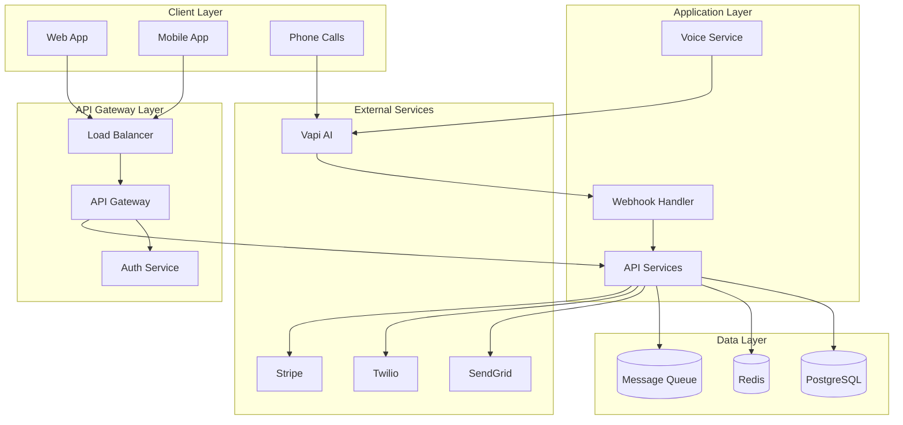
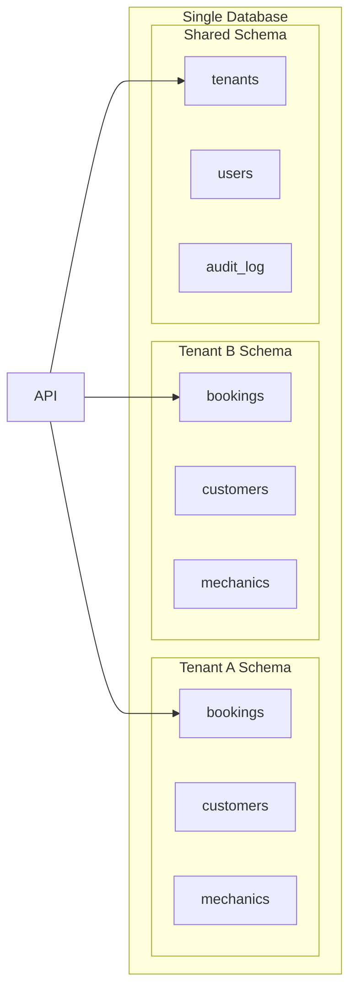
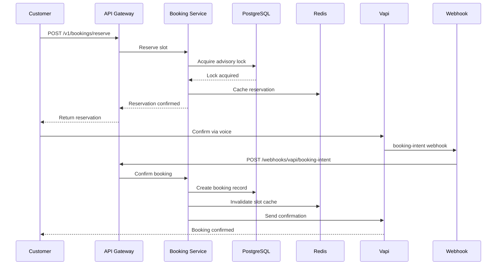
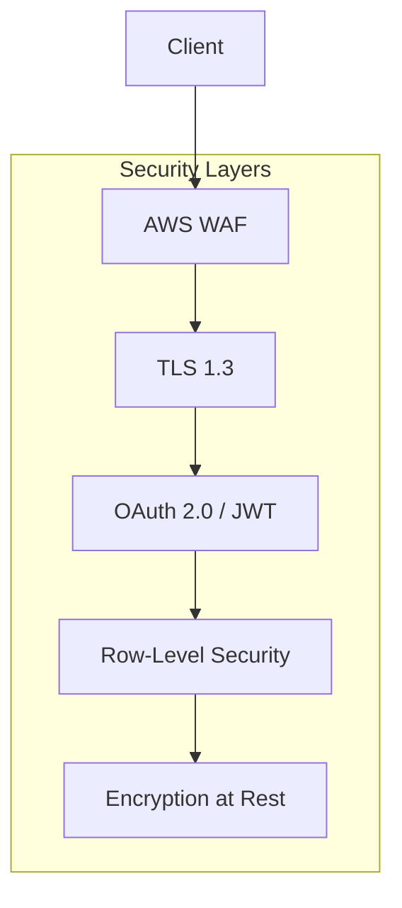
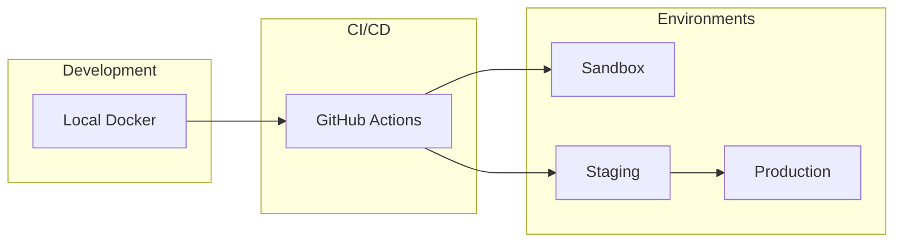

# MechMind OS Architecture Overview

MechMind OS is a multi-tenant SaaS platform for automotive repair shops, featuring AI-powered voice booking capabilities.

## System Architecture



## Component Overview

### Client Layer

| Component | Technology | Purpose |
|-----------|------------|---------|
| Web App | React, TypeScript | Shop management interface |
| Mobile App | React Native | On-the-go access |
| Phone | PSTN/SIP | Voice booking channel |

### API Gateway Layer

| Component | Technology | Purpose |
|-----------|------------|---------|
| Load Balancer | AWS ALB | Traffic distribution |
| API Gateway | Kong | Rate limiting, routing |
| Auth Service | Node.js, JWT | Authentication & authorization |

### Application Layer

| Service | Language | Responsibility |
|---------|----------|----------------|
| API Services | Go | Core business logic |
| Voice Service | Python | Vapi integration |
| Webhook Handler | Python | Async event processing |
| Worker | Go | Background jobs |

### Data Layer

| Component | Technology | Purpose |
|-----------|------------|---------|
| Primary Database | PostgreSQL 15 | Transactional data |
| Read Replica | PostgreSQL 15 | Read scaling |
| Cache | Redis 7 | Session & query caching |
| Queue | Redis/RabbitMQ | Async job processing |

## Multi-Tenant Architecture

MechMind OS uses a **single database, schema-per-tenant** approach with Row-Level Security (RLS).



### Tenant Isolation

```sql
-- Row-Level Security Policy Example
CREATE POLICY tenant_isolation ON bookings
    USING (shop_id = current_setting('app.current_tenant')::UUID);

-- Set tenant context
SET app.current_tenant = '550e8400-e29b-41d4-a716-446655440000';
```

## Scalability Design

### Horizontal Scaling

```
┌─────────────────────────────────────────────────────────┐
│                      Load Balancer                       │
└─────────────────────────────────────────────────────────┘
                           │
        ┌──────────────────┼──────────────────┐
        │                  │                  │
   ┌────▼────┐        ┌────▼────┐        ┌────▼────┐
   │ API-1   │        │ API-2   │        │ API-3   │
   │ (Pod)   │        │ (Pod)   │        │ (Pod)   │
   └────┬────┘        └────┬────┘        └────┬────┘
        │                  │                  │
        └──────────────────┼──────────────────┘
                           │
                    ┌──────▼──────┐
                    │  PostgreSQL  │
                    │   Primary    │
                    └──────┬──────┘
                           │
                    ┌──────▼──────┐
                    │   Replica    │
                    └─────────────┘
```

### Auto-Scaling Configuration

```yaml
# HPA Configuration
apiVersion: autoscaling/v2
kind: HorizontalPodAutoscaler
metadata:
  name: api-hpa
spec:
  scaleTargetRef:
    apiVersion: apps/v1
    kind: Deployment
    name: api
  minReplicas: 3
  maxReplicas: 50
  metrics:
    - type: Resource
      resource:
        name: cpu
        target:
          type: Utilization
          averageUtilization: 70
    - type: Resource
      resource:
        name: memory
        target:
          type: Utilization
          averageUtilization: 80
```

## Data Flow

### Booking Creation Flow



## Technology Stack

### Backend

| Layer | Technology | Version |
|-------|------------|---------|
| API Framework | Go + Gin | 1.21 |
| Voice Service | Python + FastAPI | 3.11 |
| Database | PostgreSQL | 15 |
| Cache | Redis | 7.0 |
| Queue | RabbitMQ | 3.12 |

### Frontend

| Layer | Technology | Version |
|-------|------------|---------|
| Web | React | 18 |
| Mobile | React Native | 0.72 |
| UI Library | Material-UI | 5 |

### Infrastructure

| Layer | Technology |
|-------|------------|
| Cloud | AWS |
| Orchestration | Kubernetes (EKS) |
| CI/CD | GitHub Actions |
| Monitoring | Datadog |
| Logging | Datadog |

## Security Architecture

See [security.md](security.md) for detailed security documentation.



## Deployment Architecture



## Performance Targets

| Metric | Target | Alert Threshold |
|--------|--------|-----------------|
| API Response Time (p95) | < 200ms | > 500ms |
| API Response Time (p99) | < 500ms | > 1s |
| Database Query Time | < 50ms | > 100ms |
| Voice Webhook Latency | < 2s | > 5s |
| Availability | 99.9% | < 99.5% |

## Capacity Planning

### Current Capacity

| Resource | Current | Max |
|----------|---------|-----|
| API Pods | 5 | 50 |
| DB Connections | 100 | 500 |
| Cache Memory | 4GB | 32GB |
| Storage | 500GB | 5TB |

### Growth Projections

| Metric | Current | 6 Months | 12 Months |
|--------|---------|----------|-----------|
| Shops | 100 | 250 | 500 |
| Daily Bookings | 1,000 | 3,000 | 8,000 |
| API Requests/day | 100K | 300K | 800K |

## Disaster Recovery

### RPO/RTO

| Scenario | RPO | RTO |
|----------|-----|-----|
| Database failure | 5 min | 15 min |
| Region failure | 1 hour | 4 hours |
| Complete disaster | 24 hours | 24 hours |

### Backup Strategy

- **Full backups**: Daily at 02:00 UTC
- **WAL archiving**: Continuous
- **Cross-region replication**: Enabled
- **Retention**: 30 days (production), 7 days (staging)

## Documentation Index

- [Database Architecture](database.md)
- [Voice Flow](voice-flow.md)
- [Security Model](security.md)
- [Compliance](compliance.md)
