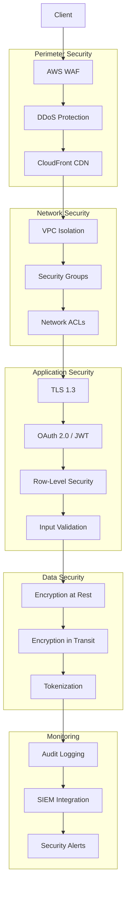

# Security Architecture

MechMind OS implements defense-in-depth security to protect customer data and ensure compliance with industry standards.

## Security Layers



## Authentication & Authorization

### JWT Token Structure

```json
{
  "header": {
    "alg": "RS256",
    "typ": "JWT",
    "kid": "key-2024-01"
  },
  "payload": {
    "sub": "550e8400-e29b-41d4-a716-446655440000",
    "iss": "mechmind.io",
    "aud": "mechmind-api",
    "iat": 1705315200,
    "exp": 1705318800,
    "scope": "bookings:read bookings:write customers:read",
    "tenant_id": "550e8400-e29b-41d4-a716-446655440001",
    "role": "admin"
  }
}
```

### Token Implementation

```python
# auth/jwt_handler.py
import jwt
from datetime import datetime, timedelta
from cryptography.hazmat.primitives import serialization

class JWTHandler:
    def __init__(self, private_key_path: str, public_key_path: str):
        with open(private_key_path, 'rb') as f:
            self.private_key = serialization.load_pem_private_key(f.read(), password=None)
        with open(public_key_path, 'rb') as f:
            self.public_key = serialization.load_pem_public_key(f.read())
    
    def create_token(
        self,
        user_id: str,
        tenant_id: str,
        role: str,
        scopes: list[str],
        expires_in: int = 3600
    ) -> str:
        """Create JWT access token"""
        now = datetime.utcnow()
        payload = {
            "sub": user_id,
            "iss": "mechmind.io",
            "aud": "mechmind-api",
            "iat": now,
            "exp": now + timedelta(seconds=expires_in),
            "scope": " ".join(scopes),
            "tenant_id": tenant_id,
            "role": role
        }
        
        return jwt.encode(payload, self.private_key, algorithm="RS256")
    
    def verify_token(self, token: str) -> dict:
        """Verify and decode JWT token"""
        try:
            payload = jwt.decode(
                token,
                self.public_key,
                algorithms=["RS256"],
                audience="mechmind-api",
                issuer="mechmind.io"
            )
            return payload
        except jwt.ExpiredSignatureError:
            raise AuthenticationError("Token has expired")
        except jwt.InvalidTokenError as e:
            raise AuthenticationError(f"Invalid token: {e}")
```

### Role-Based Access Control (RBAC)

```python
# auth/rbac.py
from enum import Enum
from functools import wraps

class Role(Enum):
    SUPER_ADMIN = "super_admin"
    ADMIN = "admin"
    MECHANIC = "mechanic"
    RECEPTIONIST = "receptionist"
    READONLY = "readonly"

PERMISSIONS = {
    Role.SUPER_ADMIN: ["*"],
    Role.ADMIN: [
        "bookings:*",
        "customers:*",
        "mechanics:*",
        "shops:read",
        "shops:write",
        "reports:*"
    ],
    Role.MECHANIC: [
        "bookings:read",
        "bookings:write",
        "customers:read",
        "mechanics:read"
    ],
    Role.RECEPTIONIST: [
        "bookings:*",
        "customers:*",
        "mechanics:read"
    ],
    Role.READONLY: [
        "bookings:read",
        "customers:read",
        "mechanics:read",
        "reports:read"
    ]
}

def require_permission(permission: str):
    """Decorator to require specific permission"""
    def decorator(func):
        @wraps(func)
        async def wrapper(*args, **kwargs):
            user = kwargs.get('current_user')
            if not user:
                raise PermissionError("Authentication required")
            
            user_permissions = PERMISSIONS.get(Role(user.role), [])
            
            # Check wildcard or specific permission
            if "*" not in user_permissions and permission not in user_permissions:
                # Check wildcard pattern
                resource, action = permission.split(":")
                if f"{resource}:*" not in user_permissions:
                    raise PermissionError(f"Permission denied: {permission}")
            
            return await func(*args, **kwargs)
        return wrapper
    return decorator

# Usage
@require_permission("bookings:write")
async def create_booking(data: dict, current_user: User):
    # Only users with bookings:write permission can execute
    pass
```

## API Security

### Rate Limiting

```python
# middleware/rate_limiter.py
import redis
from datetime import datetime

class RateLimiter:
    def __init__(self, redis_client: redis.Redis):
        self.redis = redis_client
        self.limits = {
            "basic": {"requests": 100, "window": 60},
            "standard": {"requests": 500, "window": 60},
            "premium": {"requests": 2000, "window": 60},
            "enterprise": {"requests": 10000, "window": 60}
        }
    
    async def is_allowed(self, key: str, tier: str = "standard") -> tuple[bool, dict]:
        """Check if request is within rate limit"""
        limit = self.limits.get(tier, self.limits["standard"])
        window = limit["window"]
        max_requests = limit["requests"]
        
        # Use sliding window
        now = datetime.utcnow().timestamp()
        window_start = now - window
        
        pipe = self.redis.pipeline()
        
        # Remove old entries
        pipe.zremrangebyscore(f"rate_limit:{key}", 0, window_start)
        
        # Count current requests
        pipe.zcard(f"rate_limit:{key}")
        
        # Add current request
        pipe.zadd(f"rate_limit:{key}", {str(now): now})
        pipe.expire(f"rate_limit:{key}", window)
        
        results = pipe.execute()
        current_count = results[1]
        
        allowed = current_count < max_requests
        
        headers = {
            "X-RateLimit-Limit": str(max_requests),
            "X-RateLimit-Remaining": str(max(0, max_requests - current_count - 1)),
            "X-RateLimit-Reset": str(int(now + window))
        }
        
        return allowed, headers
```

### Input Validation

```python
# validation/schemas.py
from pydantic import BaseModel, validator, Field
import re

class CreateBookingRequest(BaseModel):
    slot_id: str = Field(..., regex=r'^[0-9a-f]{8}-[0-9a-f]{4}-[0-9a-f]{4}-[0-9a-f]{4}-[0-9a-f]{12}$')
    mechanic_id: str = Field(..., regex=r'^[0-9a-f]{8}-[0-9a-f]{4}-[0-9a-f]{4}-[0-9a-f]{4}-[0-9a-f]{12}$')
    customer_phone: str = Field(..., max_length=20)
    customer_name: str = Field(None, max_length=200)
    customer_email: str = Field(None, max_length=255)
    service_type: str = Field(..., max_length=100)
    notes: str = Field(None, max_length=2000)
    
    @validator('customer_phone')
    def validate_phone(cls, v):
        # E.164 format validation
        if not re.match(r'^\+[1-9]\d{1,14}$', v):
            raise ValueError('Phone number must be in E.164 format')
        return v
    
    @validator('customer_email')
    def validate_email(cls, v):
        if v and not re.match(r'^[a-zA-Z0-9._%+-]+@[a-zA-Z0-9.-]+\.[a-zA-Z]{2,}$', v):
            raise ValueError('Invalid email format')
        return v
    
    @validator('notes')
    def sanitize_notes(cls, v):
        if v:
            # Basic XSS prevention
            v = v.replace('<', '&lt;').replace('>', '&gt;')
        return v
```

## Data Protection

### Encryption at Rest

```yaml
# Database encryption using AWS RDS
apiVersion: rds.aws/v1alpha1
kind: DBInstance
metadata:
  name: mechmind-prod
spec:
  storageEncrypted: true
  kmsKeyID: arn:aws:kms:us-east-1:123456789:key/mechmind-rds-key
  
---
# S3 bucket encryption
apiVersion: s3.aws/v1alpha1
kind: Bucket
metadata:
  name: mechmind-backups
spec:
  serverSideEncryptionConfiguration:
    rules:
      - applyServerSideEncryptionByDefault:
          sseAlgorithm: aws:kms
          kmsMasterKeyID: arn:aws:kms:us-east-1:123456789:key/mechmind-s3-key
```

### Field-Level Encryption

```python
# encryption/field_encryption.py
from cryptography.fernet import Fernet
import base64

class FieldEncryption:
    def __init__(self, key: bytes):
        self.cipher = Fernet(key)
    
    def encrypt(self, plaintext: str) -> str:
        """Encrypt sensitive field"""
        if not plaintext:
            return None
        encrypted = self.cipher.encrypt(plaintext.encode())
        return base64.urlsafe_b64encode(encrypted).decode()
    
    def decrypt(self, ciphertext: str) -> str:
        """Decrypt sensitive field"""
        if not ciphertext:
            return None
        encrypted = base64.urlsafe_b64decode(ciphertext.encode())
        return self.cipher.decrypt(encrypted).decode()

# Usage for PII fields
field_encryptor = FieldEncryption(ENCRYPTION_KEY)

# Encrypt before storing
customer.ssn = field_encryptor.encrypt(customer.ssn)

# Decrypt when reading
decrypted_ssn = field_encryptor.decrypt(customer.ssn)
```

### Tokenization

```python
# encryption/tokenization.py
import hashlib
import uuid

class TokenVault:
    """Tokenize sensitive data (credit cards, etc.)"""
    
    def __init__(self, db_connection):
        self.db = db_connection
    
    def tokenize(self, sensitive_data: str, data_type: str) -> str:
        """Replace sensitive data with token"""
        # Generate unique token
        token = f"tok_{uuid.uuid4().hex}"
        
        # Hash for lookup
        data_hash = hashlib.sha256(sensitive_data.encode()).hexdigest()
        
        # Store in vault
        await self.db.execute(
            """
            INSERT INTO token_vault (token, data_hash, encrypted_data, data_type)
            VALUES ($1, $2, $3, $4)
            """,
            token,
            data_hash,
            field_encryptor.encrypt(sensitive_data),
            data_type
        )
        
        return token
    
    def detokenize(self, token: str) -> str:
        """Retrieve original data from token"""
        result = await self.db.fetchrow(
            "SELECT encrypted_data FROM token_vault WHERE token = $1",
            token
        )
        
        if result:
            return field_encryptor.decrypt(result["encrypted_data"])
        return None
```

## Webhook Security

### Signature Verification

```python
# security/webhook_verification.py
import hmac
import hashlib
import time

class WebhookVerifier:
    def __init__(self, secret: str, tolerance_seconds: int = 300):
        self.secret = secret
        self.tolerance = tolerance_seconds
    
    def verify_signature(self, payload: bytes, signature: str, timestamp: str = None) -> bool:
        """Verify webhook signature"""
        # Check timestamp to prevent replay attacks
        if timestamp:
            current_time = int(time.time())
            webhook_time = int(timestamp)
            if abs(current_time - webhook_time) > self.tolerance:
                return False
        
        # Compute expected signature
        expected = hmac.new(
            self.secret.encode(),
            payload,
            hashlib.sha256
        ).hexdigest()
        
        # Compare signatures (constant-time)
        return hmac.compare_digest(f"sha256={expected}", signature)

# Vapi webhook verification
vapi_verifier = WebhookVerifier(VAPI_WEBHOOK_SECRET)

@app.post("/webhooks/vapi/call-event")
async def handle_vapi_webhook(request: Request):
    body = await request.body()
    signature = request.headers.get("X-Vapi-Signature")
    timestamp = request.headers.get("X-Vapi-Timestamp")
    
    if not vapi_verifier.verify_signature(body, signature, timestamp):
        raise HTTPException(status_code=401, detail="Invalid signature")
    
    # Process webhook
    ...
```

## Security Headers

```python
# middleware/security_headers.py
from starlette.middleware.base import BaseHTTPMiddleware

class SecurityHeadersMiddleware(BaseHTTPMiddleware):
    async def dispatch(self, request, call_next):
        response = await call_next(request)
        
        # Prevent clickjacking
        response.headers["X-Frame-Options"] = "DENY"
        
        # Prevent MIME sniffing
        response.headers["X-Content-Type-Options"] = "nosniff"
        
        # XSS protection
        response.headers["X-XSS-Protection"] = "1; mode=block"
        
        # Content Security Policy
        response.headers["Content-Security-Policy"] = (
            "default-src 'self'; "
            "script-src 'self' 'unsafe-inline'; "
            "style-src 'self' 'unsafe-inline'; "
            "img-src 'self' data: https:; "
            "font-src 'self'; "
            "connect-src 'self' https://api.mechmind.io;"
        )
        
        # Strict Transport Security
        response.headers["Strict-Transport-Security"] = (
            "max-age=31536000; includeSubDomains; preload"
        )
        
        # Referrer Policy
        response.headers["Referrer-Policy"] = "strict-origin-when-cross-origin"
        
        # Permissions Policy
        response.headers["Permissions-Policy"] = (
            "camera=(), microphone=(), geolocation=(self)"
        )
        
        return response
```

## Audit Logging

```python
# audit/audit_logger.py
import json
from datetime import datetime
from enum import Enum

class AuditEventType(Enum):
    LOGIN = "login"
    LOGOUT = "logout"
    BOOKING_CREATED = "booking_created"
    BOOKING_UPDATED = "booking_updated"
    CUSTOMER_CREATED = "customer_created"
    DATA_EXPORTED = "data_exported"
    DATA_DELETED = "data_deleted"
    PERMISSION_CHANGED = "permission_changed"

class AuditLogger:
    def __init__(self, db_connection, logger):
        self.db = db_connection
        self.logger = logger
    
    async def log(
        self,
        event_type: AuditEventType,
        user_id: str,
        tenant_id: str,
        resource_type: str,
        resource_id: str = None,
        action: str = None,
        old_values: dict = None,
        new_values: dict = None,
        ip_address: str = None,
        user_agent: str = None
    ):
        """Log audit event"""
        
        # Don't log sensitive fields
        sanitized_old = self._sanitize(old_values) if old_values else None
        sanitized_new = self._sanitize(new_values) if new_values else None
        
        audit_record = {
            "event_type": event_type.value,
            "user_id": user_id,
            "tenant_id": tenant_id,
            "resource_type": resource_type,
            "resource_id": resource_id,
            "action": action,
            "old_values": json.dumps(sanitized_old) if sanitized_old else None,
            "new_values": json.dumps(sanitized_new) if sanitized_new else None,
            "ip_address": ip_address,
            "user_agent": user_agent,
            "timestamp": datetime.utcnow()
        }
        
        # Store in database
        await self.db.execute(
            """
            INSERT INTO audit_log 
            (event_type, user_id, tenant_id, resource_type, resource_id, 
             action, old_values, new_values, ip_address, user_agent, timestamp)
            VALUES 
            ($1, $2, $3, $4, $5, $6, $7, $8, $9, $10, $11)
            """,
            *audit_record.values()
        )
        
        # Also log to SIEM for real-time monitoring
        self.logger.info("Audit event", extra=audit_record)
    
    def _sanitize(self, data: dict) -> dict:
        """Remove sensitive fields from audit log"""
        sensitive_fields = {'password', 'ssn', 'credit_card', 'cvv', 'token'}
        return {k: v for k, v in data.items() if k not in sensitive_fields}
```

## Vulnerability Management

### Dependency Scanning

```yaml
# .github/workflows/security-scan.yml
name: Security Scan

on:
  push:
    branches: [main]
  pull_request:
    branches: [main]
  schedule:
    - cron: '0 0 * * 0'  # Weekly

jobs:
  dependency-check:
    runs-on: ubuntu-latest
    steps:
      - uses: actions/checkout@v3
      
      - name: Run Trivy vulnerability scanner
        uses: aquasecurity/trivy-action@master
        with:
          scan-type: 'fs'
          scan-ref: '.'
          format: 'sarif'
          output: 'trivy-results.sarif'
      
      - name: Upload results
        uses: github/codeql-action/upload-sarif@v2
        with:
          sarif_file: 'trivy-results.sarif'
```

### Penetration Testing

| Test Type | Frequency | Tool/Provider |
|-----------|-----------|---------------|
| SAST | Every PR | SonarQube, CodeQL |
| DAST | Weekly | OWASP ZAP |
| Dependency Scan | Daily | Snyk, Trivy |
| Penetration Test | Quarterly | External vendor |
| Infrastructure Scan | Weekly | Prowler, ScoutSuite |

## Incident Response

### Security Incident Classification

| Severity | Examples | Response Time |
|----------|----------|---------------|
| Critical | Data breach, RCE vulnerability | 1 hour |
| High | Unauthorized access, XSS | 4 hours |
| Medium | Information disclosure | 24 hours |
| Low | Policy violation | 72 hours |

### Security Incident Response Steps

1. **Detect** - Monitor alerts from SIEM, WAF, etc.
2. **Contain** - Isolate affected systems
3. **Eradicate** - Remove threat actor access
4. **Recover** - Restore normal operations
5. **Learn** - Document and improve

## Compliance

### Certifications

- **SOC 2 Type II** - In progress
- **PCI DSS** - For payment processing
- **GDPR** - EU data protection
- **CCPA** - California privacy

### Security Checklist

- [ ] All data encrypted at rest
- [ ] All data encrypted in transit (TLS 1.3)
- [ ] Multi-factor authentication enabled
- [ ] Regular security audits
- [ ] Penetration testing completed
- [ ] Incident response plan documented
- [ ] Employee security training completed
- [ ] Third-party vendor assessments
- [ ] Data retention policies implemented
