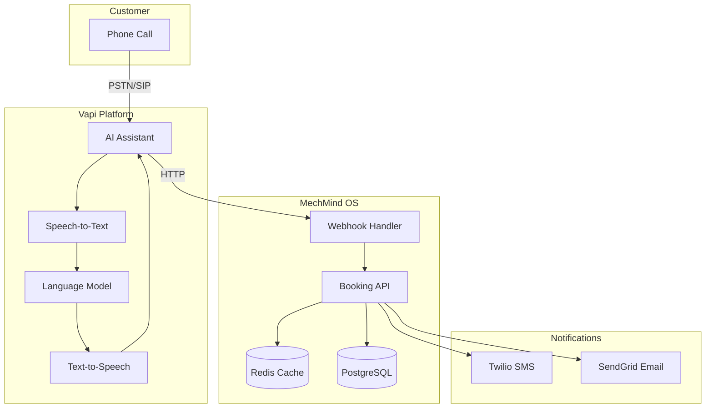
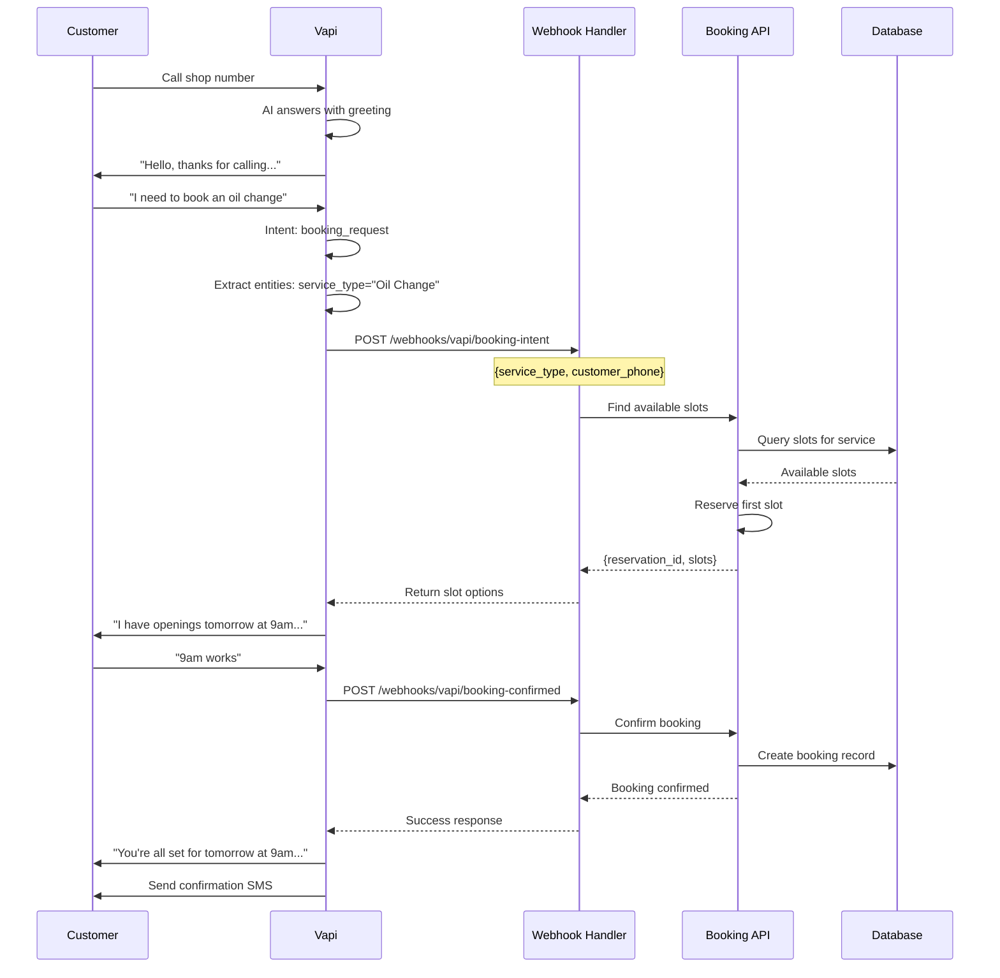

# Voice AI Integration Architecture

MechMind OS integrates with Vapi for AI-powered voice booking, enabling customers to schedule appointments through natural phone conversations.

## Voice System Overview



## Call Flow

### Incoming Call Flow



## Vapi Configuration

### Assistant Configuration

```json
{
  "name": "MechMind Booking Assistant",
  "model": {
    "provider": "openai",
    "model": "gpt-4",
    "temperature": 0.7,
    "systemPrompt": "You are a helpful booking assistant for an auto repair shop. Your job is to help customers schedule appointments. Be friendly, professional, and efficient. Collect necessary information: service needed, preferred date/time, and customer details."
  },
  "voice": {
    "provider": "elevenlabs",
    "voiceId": "bella"
  },
  "firstMessage": "Hello! Thank you for calling {{shop.name}}. I'm your automated booking assistant. How can I help you today?",
  "endCallFunctionEnabled": true,
  "endCallMessage": "Thank you for calling! Your appointment is confirmed. You'll receive a confirmation text shortly. Have a great day!",
  "webhookUrl": "https://api.mechmind.io/webhooks/vapi/call-event",
  "webhookHeaders": {
    "X-Vapi-Signature": "{{webhook_secret}}"
  }
}
```

### Function Definitions

```json
{
  "functions": [
    {
      "name": "check_availability",
      "description": "Check available appointment slots",
      "parameters": {
        "type": "object",
        "properties": {
          "date": {
            "type": "string",
            "description": "Date in YYYY-MM-DD format"
          },
          "service_type": {
            "type": "string",
            "description": "Type of service requested"
          },
          "preferred_time": {
            "type": "string",
            "enum": ["morning", "afternoon", "evening"]
          }
        },
        "required": ["date", "service_type"]
      }
    },
    {
      "name": "create_booking",
      "description": "Create a new booking",
      "parameters": {
        "type": "object",
        "properties": {
          "slot_id": {
            "type": "string",
            "description": "ID of the selected time slot"
          },
          "customer_name": {
            "type": "string"
          },
          "customer_phone": {
            "type": "string"
          },
          "vehicle_make": {
            "type": "string"
          },
          "vehicle_model": {
            "type": "string"
          },
          "service_type": {
            "type": "string"
          }
        },
        "required": ["slot_id", "customer_name", "customer_phone"]
      }
    },
    {
      "name": "lookup_customer",
      "description": "Find existing customer by phone",
      "parameters": {
        "type": "object",
        "properties": {
          "phone": {
            "type": "string"
          }
        },
        "required": ["phone"]
      }
    }
  ]
}
```

## Webhook Handlers

### Call Event Handler

```python
# webhook_handlers/call_event.py
from fastapi import APIRouter, Request, HTTPException
import hmac
import hashlib
import json

router = APIRouter()

async def verify_signature(payload: bytes, signature: str, secret: str) -> bool:
    """Verify Vapi webhook signature"""
    expected = hmac.new(
        secret.encode(),
        payload,
        hashlib.sha256
    ).hexdigest()
    return hmac.compare_digest(f"sha256={expected}", signature)

@router.post("/webhooks/vapi/call-event")
async def handle_call_event(request: Request):
    # Verify signature
    body = await request.body()
    signature = request.headers.get("X-Vapi-Signature", "")
    
    if not await verify_signature(body, signature, VAPI_WEBHOOK_SECRET):
        raise HTTPException(status_code=401, detail="Invalid signature")
    
    event = json.loads(body)
    event_type = event.get("event_type")
    
    handlers = {
        "call.started": handle_call_started,
        "call.ended": handle_call_ended,
        "call.transcript": handle_transcript,
        "booking.intent": handle_booking_intent,
        "booking.confirmed": handle_booking_confirmed,
    }
    
    handler = handlers.get(event_type)
    if handler:
        await handler(event)
    
    return {"status": "processed"}

async def handle_call_started(event: dict):
    """Log call start"""
    await log_call_event(
        call_id=event["call_id"],
        event_type="started",
        phone_number=event["payload"]["customer"]["number"]
    )

async def handle_call_ended(event: dict):
    """Process call end, update metrics"""
    await log_call_event(
        call_id=event["call_id"],
        event_type="ended",
        duration_seconds=event["payload"]["duration_seconds"],
        outcome=event["payload"].get("outcome")
    )
```

### Booking Intent Handler

```python
# webhook_handlers/booking_intent.py
from typing import List, Optional
from datetime import datetime, timedelta
import uuid

@router.post("/webhooks/vapi/booking-intent")
async def handle_booking_intent(event: dict):
    """
    Handle booking intent from voice conversation.
    Finds available slots and reserves one.
    """
    payload = event.get("payload", {})
    
    # Extract parameters
    customer_phone = payload.get("customer_phone")
    requested_date = payload.get("requested_date")
    service_type = payload.get("service_type")
    preferred_time = payload.get("preferred_time")
    
    # Lookup or create customer
    customer = await lookup_or_create_customer(customer_phone)
    
    # Find available slots
    slots = await find_available_slots(
        date=requested_date,
        service_type=service_type,
        preferred_time=preferred_time,
        tenant_id=event["tenant_id"]
    )
    
    if not slots:
        return {
            "success": False,
            "message": "No slots available for the requested date",
            "suggested_dates": await get_alternative_dates(
                service_type=service_type,
                days=3
            )
        }
    
    # Reserve the first available slot
    reservation = await reserve_slot(
        slot_id=slots[0]["id"],
        customer_phone=customer_phone,
        duration_seconds=300  # 5 minutes
    )
    
    return {
        "success": True,
        "reservation_id": reservation["id"],
        "expires_at": reservation["expires_at"],
        "available_slots": slots[:3],  # Return top 3 options
        "confirmation_required": True
    }

async def find_available_slots(
    date: str,
    service_type: str,
    preferred_time: Optional[str],
    tenant_id: str
) -> List[dict]:
    """Find available slots matching customer preferences"""
    
    # Get service duration
    service_duration = await get_service_duration(service_type)
    
    # Build time filter based on preference
    time_filter = build_time_filter(preferred_time)
    
    # Query available slots
    query = """
        SELECT 
            s.id,
            s.start_time,
            s.end_time,
            m.id as mechanic_id,
            m.first_name || ' ' || m.last_name as mechanic_name,
            m.specialties
        FROM time_slots s
        JOIN mechanics m ON s.mechanic_id = m.id
        WHERE s.tenant_id = :tenant_id
          AND DATE(s.start_time) = :date
          AND s.is_available = true
          AND s.is_reserved = false
          AND s.duration_minutes >= :duration
          AND :start_time <= s.start_time
          AND s.start_time < :end_time
        ORDER BY s.start_time
        LIMIT 5
    """
    
    result = await db.fetch_all(
        query,
        {
            "tenant_id": tenant_id,
            "date": date,
            "duration": service_duration,
            "start_time": time_filter["start"],
            "end_time": time_filter["end"]
        }
    )
    
    return [dict(row) for row in result]
```

### Booking Confirmation Handler

```python
# webhook_handlers/booking_confirmed.py

@router.post("/webhooks/vapi/booking-confirmed")
async def handle_booking_confirmed(event: dict):
    """
    Convert reservation to confirmed booking.
    """
    payload = event.get("payload", {})
    reservation_id = payload.get("reservation_id")
    
    # Get reservation details
    reservation = await get_reservation(reservation_id)
    
    if not reservation or reservation["expired"]:
        return {
            "success": False,
            "error": "Reservation expired",
            "suggestion": "Please check availability again"
        }
    
    # Create customer if new
    customer = await get_or_create_customer(
        phone=payload.get("customer_phone"),
        name=payload.get("customer_name")
    )
    
    # Create booking
    booking = await create_booking(
        slot_id=reservation["slot_id"],
        mechanic_id=reservation["mechanic_id"],
        customer_id=customer["id"],
        service_type=payload.get("service_type"),
        vehicle_info={
            "make": payload.get("vehicle_make"),
            "model": payload.get("vehicle_model"),
            "year": payload.get("vehicle_year")
        },
        source="voice"
    )
    
    # Send confirmation
    await send_booking_confirmation(
        booking=booking,
        customer=customer
    )
    
    return {
        "success": True,
        "booking_id": booking["id"],
        "confirmation_sent": True
    }

async def send_booking_confirmation(booking: dict, customer: dict):
    """Send confirmation via SMS and email"""
    
    # SMS confirmation
    sms_body = f"""
    Your appointment is confirmed!
    
    Date: {booking['slot']['start_time'].strftime('%A, %B %d at %I:%M %p')}
    Service: {booking['service_type']}
    
    Reply CANCEL to cancel.
    """
    
    await twilio_client.messages.create(
        to=customer["phone"],
        from_=TWILIO_PHONE_NUMBER,
        body=sms_body
    )
    
    # Email confirmation (if email available)
    if customer.get("email"):
        await sendgrid_client.send(
            to=customer["email"],
            template_id="booking_confirmation",
            dynamic_data={
                "customer_name": customer["name"],
                "booking_date": booking["slot"]["start_time"].strftime("%B %d, %Y"),
                "booking_time": booking["slot"]["start_time"].strftime("%I:%M %p"),
                "service_type": booking["service_type"],
                "mechanic_name": booking["mechanic"]["name"]
            }
        )
```

## Slot Reservation System

### Advisory Lock Implementation

```python
# services/slot_reservation.py
import asyncpg

async def reserve_slot_with_lock(
    conn: asyncpg.Connection,
    slot_id: str,
    customer_phone: str,
    duration_seconds: int = 300
) -> dict:
    """
    Reserve a slot using PostgreSQL advisory locks.
    Prevents double-booking during voice conversations.
    """
    
    # Generate lock ID from slot_id
    lock_id = int(slot_id.replace("-", ""), 16) % (2**63)
    
    async with conn.transaction():
        # Try to acquire advisory lock
        lock_acquired = await conn.fetchval(
            "SELECT pg_try_advisory_lock($1)",
            lock_id
        )
        
        if not lock_acquired:
            raise SlotAlreadyReservedError("Slot is being processed by another request")
        
        try:
            # Check slot availability
            slot = await conn.fetchrow(
                """
                SELECT id, is_available, is_reserved, reserved_until
                FROM time_slots
                WHERE id = $1
                FOR UPDATE
                """,
                slot_id
            )
            
            if not slot or not slot["is_available"] or slot["is_reserved"]:
                raise SlotUnavailableError("Slot is no longer available")
            
            # Create reservation
            reservation_id = str(uuid.uuid4())
            expires_at = datetime.utcnow() + timedelta(seconds=duration_seconds)
            
            await conn.execute(
                """
                UPDATE time_slots
                SET is_reserved = true,
                    reserved_until = $2,
                    reservation_id = $3
                WHERE id = $1
                """,
                slot_id,
                expires_at,
                reservation_id
            )
            
            # Store reservation in cache for quick lookup
            await redis.setex(
                f"reservation:{reservation_id}",
                duration_seconds,
                json.dumps({
                    "slot_id": slot_id,
                    "customer_phone": customer_phone,
                    "expires_at": expires_at.isoformat()
                })
            )
            
            return {
                "id": reservation_id,
                "slot_id": slot_id,
                "expires_at": expires_at,
                "customer_phone": customer_phone
            }
            
        finally:
            # Always release the advisory lock
            await conn.execute(
                "SELECT pg_advisory_unlock($1)",
                lock_id
            )
```

## Voice Analytics

### Call Metrics

```python
# analytics/voice_metrics.py

async def record_call_metrics(call_data: dict):
    """Record voice call metrics for analytics"""
    
    metrics = {
        "call_id": call_data["call_id"],
        "tenant_id": call_data["tenant_id"],
        "duration_seconds": call_data["duration"],
        "outcome": call_data.get("outcome"),
        "booking_created": call_data.get("booking_id") is not None,
        "transcript_length": len(call_data.get("transcript", [])),
        "timestamp": datetime.utcnow()
    }
    
    # Store in time-series database
    await timeseries_db.insert("voice_calls", metrics)
    
    # Update real-time metrics
    await prometheus_metrics.voice_calls_total.inc()
    await prometheus_metrics.voice_call_duration.observe(metrics["duration_seconds"])
    
    if metrics["booking_created"]:
        await prometheus_metrics.voice_bookings_total.inc()

async def get_voice_analytics(tenant_id: str, days: int = 30) -> dict:
    """Get voice analytics for a tenant"""
    
    query = """
        SELECT 
            COUNT(*) as total_calls,
            COUNT(*) FILTER (WHERE booking_created) as booking_calls,
            AVG(duration_seconds) as avg_duration,
            PERCENTILE_CONT(0.95) WITHIN GROUP (ORDER BY duration_seconds) as p95_duration
        FROM voice_calls
        WHERE tenant_id = :tenant_id
          AND timestamp > NOW() - INTERVAL ':days days'
    """
    
    result = await timeseries_db.fetch_one(query, {"tenant_id": tenant_id, "days": days})
    
    return {
        "total_calls": result["total_calls"],
        "booking_calls": result["booking_calls"],
        "conversion_rate": result["booking_calls"] / result["total_calls"] if result["total_calls"] > 0 else 0,
        "avg_duration_seconds": result["avg_duration"],
        "p95_duration_seconds": result["p95_duration"]
    }
```

## Error Handling

### Fallback Strategy

```python
# voice/fallback.py

async def handle_voice_failure(call_id: str, error: Exception):
    """Handle voice system failures gracefully"""
    
    # Log the error
    logger.error(f"Voice system error for call {call_id}: {error}")
    
    # Notify operations team
    await pagerduty.create_incident(
        title=f"Voice system error: {type(error).__name__}",
        details={"call_id": call_id, "error": str(error)}
    )
    
    # Enable fallback mode
    await enable_fallback_mode(temporary=True)
    
    # If customer was mid-booking, send SMS with booking link
    if call_id in active_bookings:
        customer_phone = active_bookings[call_id]["customer_phone"]
        await twilio_client.messages.create(
            to=customer_phone,
            body="Sorry, we're experiencing technical difficulties. Please book online: https://mechmind.io/book"
        )

async def enable_fallback_mode(temporary: bool = False):
    """Enable fallback to manual booking"""
    
    # Update configuration
    await config.set("voice.fallback_enabled", True)
    
    # Route calls to human receptionist
    await vapi.update_assistant(
        assistant_id=MAIN_ASSISTANT_ID,
        config={
            "firstMessage": "Please hold while we connect you to a representative.",
            "endCallFunctionEnabled": False
        }
    )
    
    if not temporary:
        # Permanent fallback - notify all shops
        await notify_all_shops(
            "Voice booking is temporarily unavailable. Please use web booking."
        )
```

## Testing

### Voice Flow Testing

```python
# tests/test_voice_flow.py
import pytest
from unittest.mock import Mock, patch

@pytest.mark.asyncio
async def test_booking_intent_webhook():
    """Test booking intent webhook handler"""
    
    event = {
        "event_type": "booking.intent",
        "call_id": "call_test_123",
        "tenant_id": "tenant_123",
        "payload": {
            "customer_phone": "+14155551234",
            "requested_date": "2024-01-20",
            "service_type": "Oil Change",
            "preferred_time": "morning"
        }
    }
    
    with patch("services.slot_service.find_available_slots") as mock_find:
        mock_find.return_value = [
            {"id": "slot_1", "start_time": "09:00", "mechanic_name": "Mike"}
        ]
        
        response = await handle_booking_intent(event)
        
        assert response["success"] is True
        assert "reservation_id" in response
        assert len(response["available_slots"]) > 0

@pytest.mark.asyncio
async def test_slot_reservation_concurrency():
    """Test that advisory locks prevent double-booking"""
    
    slot_id = "slot_test_123"
    
    # Try to reserve same slot from two concurrent requests
    import asyncio
    
    async def reserve():
        return await reserve_slot(slot_id, "+14155551111")
    
    results = await asyncio.gather(
        reserve(),
        reserve(),
        return_exceptions=True
    )
    
    # Only one should succeed
    successes = [r for r in results if not isinstance(r, Exception)]
    assert len(successes) == 1
```
