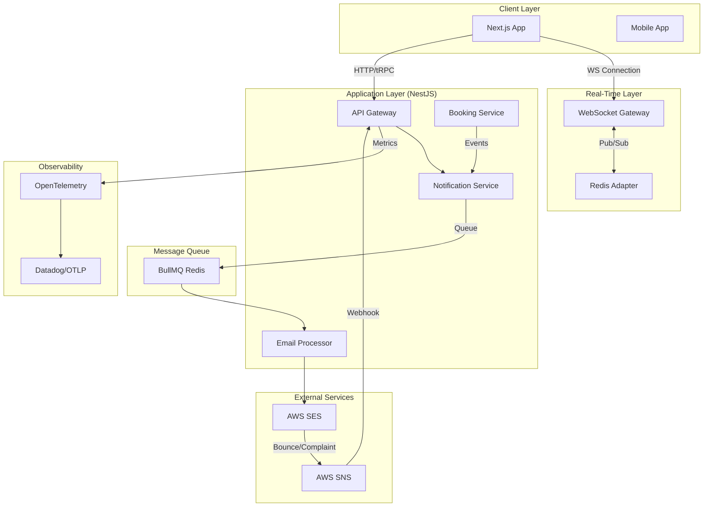
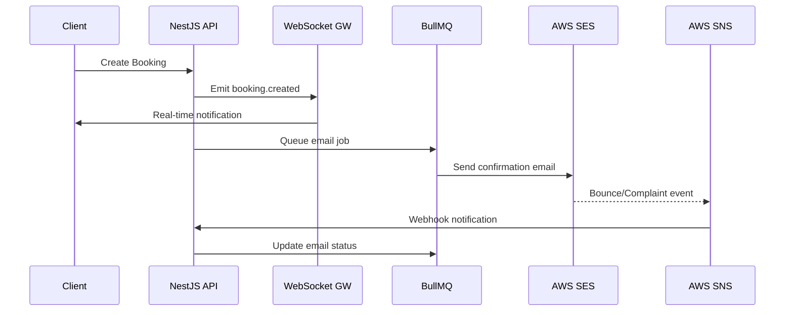

# MechMind OS v10 - Notifications & Observability Architecture

> **Technical Specification Document**  
> **Version**: 1.0.0  
> **Date**: 2026-03-02  
> **Classification**: Internal - Engineering  
> **Author**: Platform Engineering Team

---

## 1. Executive Summary

This document specifies the architecture for implementing a hybrid notification system (WebSocket real-time + AWS SES email) and comprehensive observability stack for MechMind OS v10. The solution follows 2026 best practices for B2B SaaS multi-tenant applications.

### 1.1 Key Design Decisions

| Decision | Rationale | Trade-offs |
|----------|-----------|------------|
| **WebSocket + Redis Adapter** | Enables horizontal scaling across multiple server instances | Added Redis dependency |
| **AWS SES + SNS** | Industry standard for email deliverability, built-in bounce handling | AWS vendor lock-in |
| **BullMQ for Email Queue** | Reliable job processing with exponential backoff | Requires Redis persistence |
| **OpenTelemetry** | Vendor-agnostic observability, future-proof | Initial setup complexity |
| **Playwright for E2E** | Most reliable framework in 2026 benchmarks | Resource intensive |

---

## 2. High-Level Architecture

### 2.1 System Overview



### 2.2 Notification Flow



---

## 3. Backend Architecture

### 3.1 WebSocket Gateway

```typescript
// Architecture Pattern
@WebSocketGateway({
  namespace: 'notifications',
  cors: { origin: process.env.FRONTEND_URL },
})
export class NotificationsGateway {
  // Redis adapter for multi-instance scaling
  @WebSocketServer()
  server: Server;

  // Connection management
  private connections: Map<string, Socket[]> = new Map();
  
  // Authentication
  async handleConnection(client: Socket) {
    const token = client.handshake.auth.token;
    const user = await this.authService.verifyToken(token);
    client.data.user = user;
    client.join(`tenant:${user.tenantId}`);
    client.join(`user:${user.userId}`);
  }
}
```

### 3.2 Multi-Tenancy Isolation

```
Room Structure:
- tenant:{tenantId} - Broadcast to all users in tenant
- user:{userId} - Direct message to specific user
- mechanic:{mechanicId} - Role-based rooms
```

### 3.3 Email Processing Pipeline

```
1. Event Triggered (booking.created)
2. NotificationService.enqueueEmail()
3. BullMQ Job Created with tenant context
4. EmailProcessor.execute()
5. AWS SES Send
6. SNS Callback on bounce/complaint
7. Status update in database
```

---

## 4. Frontend Architecture

### 4.1 WebSocket Client

```typescript
// NotificationContext
interface NotificationContextType {
  socket: Socket | null;
  notifications: Notification[];
  unreadCount: number;
  connect: () => void;
  disconnect: () => void;
  markAsRead: (id: string) => void;
}

// Auto-reconnection with exponential backoff
const RECONNECT_DELAY = [1000, 2000, 5000, 10000, 30000];
```

### 4.2 UI Components

```
NotificationBell
├── Badge (unread count)
├── Dropdown Panel
│   ├── NotificationList
│   │   ├── NotificationItem
│   │   │   ├── Icon
│   │   │   ├── Title
│   │   │   ├── Timestamp
│   │   │   └── Mark as read
│   └── Mark all as read
└── Settings link

ToastContainer
└── Toast (Apple-style)
    ├── Icon
    ├── Message
    └── Action (optional)
```

---

## 5. AWS Infrastructure

### 5.1 SES Configuration

```
SES Identity: mechmind.io (verified domain)
├── DKIM: Enabled
├── SPF: Enabled
├── DMARC: Enabled
└── Configuration Sets:
    ├── tracking-opens: true
    ├── tracking-clicks: true
    └── event-destination: SNS
```

### 5.2 SNS Topics

```
ses-bounces
├── HTTP Endpoint: /webhooks/ses/bounce
└── Message Attributes: tenantId, emailId

ses-complaints
├── HTTP Endpoint: /webhooks/ses/complaint
└── Message Attributes: tenantId, emailId

ses-deliveries
├── HTTP Endpoint: /webhooks/ses/delivery
└── For analytics
```

---

## 6. Observability Stack

### 6.1 Metrics

| Metric | Type | Description |
|--------|------|-------------|
| `websocket.connections.active` | Gauge | Active WS connections |
| `websocket.messages.sent` | Counter | Messages sent per minute |
| `email.queue.size` | Gauge | BullMQ queue depth |
| `email.sent.total` | Counter | Total emails sent |
| `email.bounce.rate` | Gauge | Bounce percentage |
| `api.response.time` | Histogram | API latency |
| `booking.creation.duration` | Histogram | End-to-end booking time |

### 6.2 Tracing

```
Trace: booking-creation-flow
├── HTTP POST /bookings (200ms)
├── Prisma Transaction (50ms)
├── WebSocket Emit (10ms)
├── BullMQ Add Job (5ms)
└── SES Send Email (200ms)
```

---

## 7. Security Considerations

### 7.1 WebSocket Security

```
1. JWT Validation on connection
2. Tenant isolation via rooms
3. Rate limiting: max 100 connections per user
4. Message size limit: 10KB
5. Origin validation
```

### 7.2 Email Security

```
1. SPF, DKIM, DMARC configured
2. Bounce handling to protect reputation
3. Unsubscribe links in all emails
4. No PII in email logs
5. Encryption at rest (S3)
```

---

## 8. Performance Targets

| Metric | Target | SLA |
|--------|--------|-----|
| WebSocket Latency | < 100ms | P95 |
| Email Delivery | < 5 minutes | P99 |
| Notification Delivery | < 1 second | P99 |
| System Availability | 99.9% | Monthly |
| Bounce Rate | < 3% | Continuous |

---

## 9. Deployment Strategy

### 9.1 Rolling Deployment

```
1. Deploy new backend version
2. Gradually shift traffic (10% → 50% → 100%)
3. Monitor error rates
4. Rollback if > 0.1% errors
```

### 9.2 Database Migrations

```sql
-- New tables for notifications
CREATE TABLE notifications (
  id UUID PRIMARY KEY DEFAULT gen_random_uuid(),
  tenant_id UUID NOT NULL,
  user_id UUID NOT NULL,
  type VARCHAR(50) NOT NULL,
  title VARCHAR(255) NOT NULL,
  message TEXT,
  data JSONB,
  is_read BOOLEAN DEFAULT false,
  created_at TIMESTAMP DEFAULT now(),
  read_at TIMESTAMP
);

CREATE TABLE email_logs (
  id UUID PRIMARY KEY DEFAULT gen_random_uuid(),
  tenant_id UUID NOT NULL,
  notification_id UUID REFERENCES notifications(id),
  to_address VARCHAR(255) NOT NULL,
  subject VARCHAR(255) NOT NULL,
  status VARCHAR(50) DEFAULT 'queued',
  ses_message_id VARCHAR(255),
  bounce_reason TEXT,
  sent_at TIMESTAMP,
  delivered_at TIMESTAMP
);
```

---

## 10. Testing Strategy

### 10.1 Test Pyramid

```
E2E (Playwright): 10%
├── Booking → Notification flow
├── Email delivery verification
└── WebSocket reconnection

Integration: 30%
├── WebSocket gateway
├── BullMQ processing
├── SES/SNS webhooks
└── Multi-tenancy isolation

Unit: 60%
├── Service methods
├── DTO validation
└── Utility functions
```

### 10.2 Load Testing

```
Scenario: 1000 concurrent WebSocket connections
├── Ramp up: 100 connections/second
├── Sustain: 10 minutes
├── Messages: 100 messages/second
└── Target: < 50ms latency P95
```

---

**END OF DOCUMENT**
